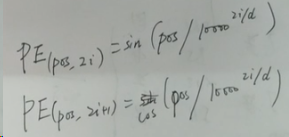
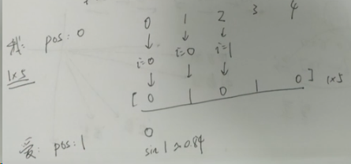
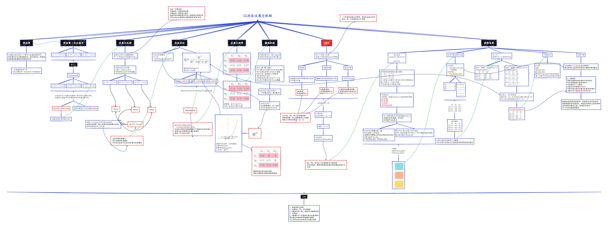
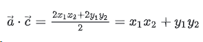
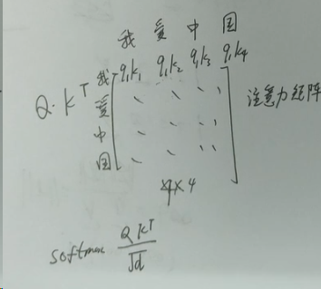
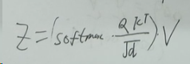
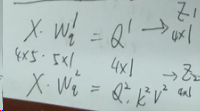

# 一、词嵌入
用一个一行多列的向量
代替一个词

# 二、QKV
## 1、Positional Encoding（位置编码）

$$PE_{(pos, 2i)} = \sin\left(\frac{pos}{10000^{2i/d_{\text{model}}}}\right)$$
$$PE_{(pos, 2i+1)} = \cos\left(\frac{pos}{10000^{2i/d_{\text{model}}}}\right)$$
pos：这个字在句子中的第几位
d：嵌入维度
i：具体第几个维度

以上述 我爱中国 为例

pos：0-3
d: 5
i： 0-2，用2i或2i+1覆盖整个维度，对应0-4

PE(pos,2i)=sin()
PE(pos,2i+1)=cos()

pos=0时,对应 "我" 这个字
i=0,2i=0     ,PE=sin0=0
i=0,2i+1=1,PE=cos0=1
i=1,2i=2     ,PE=sin0=0
i=1,2i+1=3,PE=cos0=1
i=2,2i=4     ,PE=sin0=0

“我”的位置编码为[0 1 0 1 0]即1x5

pos=1时,对应 "爱" 这个字
i=0,2i=0     ,PE=sin1≈0.84
i=0,2i+1=1,PE=cos1≈0.54

四个字组成4x5的矩阵，跟词嵌入形状相同

另起一列，用1到无穷表示位置，在数据很大时效果不好。

而使用sin、cos利用和差化积，可以用前面位置编码的信息表示后面的位置编码

例：PE(pos+k)可以由PE(pos)得到。公式为

$$\sin(a+b) = \sin a \cos b + \cos a \sin b
$$

Transformer真正的输入，不是词嵌入也不是PE，而是两者相加[4x5]+[4x5]=[4x5]

QKV

query 查询
key 键
value 值

向量内积，两向量内积结果越大，两向量相似程度越大

此方法未考虑向量长度，若其中一个向量长度很高，内积结果很大，但向量相似度并不高，可以除以向量模长来解决。
在Transformer中，除以根号k_dim(根号k_dim为q、k的列数)，用以解决transformer中数值过大的问题

## 三、自注意力机制
经过自注意力计算后形状不发生变化，例中依旧为4x5

$$Attention(Q, K, V) = softmax\left(\frac{QK^T}{\sqrt{d_k}}\right)V$$
A=Q * Kt
Z=A * Z

多头注意力

4x5为例，自注意力Z[4x5],多头注意力的一头Z1[4x1],Z由多头组成，又为[4x5]
注意力机制，一定要使用多头注意力，自注意时，每个字对自己的注意力是最高的

多头则可以把所有头的注意力权重都获取到

layer normalization(**横向规范化**)

batch size(批次大小)