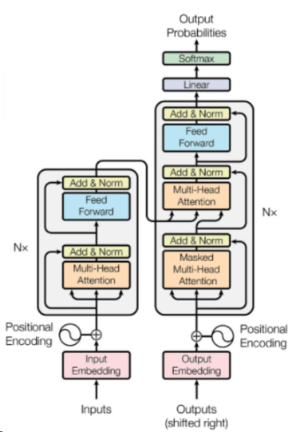

# 一、词嵌入
用一个一行多列的向量
代替一个词

# 二、QKV
## 1、Positional Encoding（位置编码）
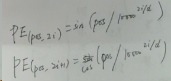

$$PE_{(pos, 2i)} = \sin\left(\frac{pos}{10000^{2i/d_{\text{model}}}}\right)$$

$$PE_{(pos, 2i+1)} = \cos\left(\frac{pos}{10000^{2i/d_{\text{model}}}}\right)$$

pos：这个字在句子中的第几位
d：嵌入维度(设，通常较大，如512列)

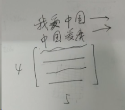

i：具体第几个维度

以上述 我爱中国 为例

pos：0-3
d: 5
i： 0-2，用2i或2i+1覆盖整个维度，对应0-4

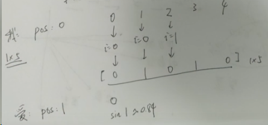

$$PE_{(pos, 2i)} = \sin\left(\frac{pos}{10000^{2i/d_{\text{model}}}}\right)$$
$$PE_{(pos, 2i+1)} = \cos\left(\frac{pos}{10000^{2i/d_{\text{model}}}}\right)$$

pos=0时,对应 "我" 这个字[1x5]的d=5列对应0,1,2,3,4

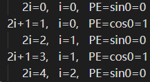

“我”的位置编码为[0 1 0 1 0]即1x5

pos=1时,对应 "爱" 这个字
i=0,2i=0     ,PE=sin1≈0.84
i=0,2i+1=1,PE=cos1≈0.54

四个字组成4x5的矩阵，跟词嵌入形状相同

### 位置编码表示方式
1.另起一列，用1到无穷表示位置，在数据很大时效果不好。

**2.使用sin、cos利用和差化积，可以用前面位置编码的信息表示后面的位置编码**

例：PE(pos+k)可以由PE(pos)得到。公式为

$$\sin(a+b) = \sin a \cos b + \cos a \sin b
$$

Transformer真正的输入，不是词嵌入也不是PE，而是两者相加[4x5]+[4x5]=[4x5]

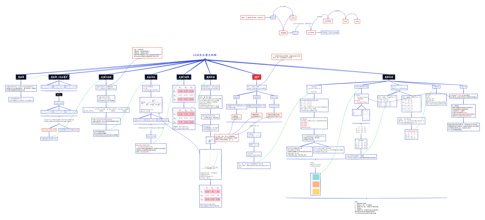

QKV

query 查询
key 键
value 值

向量内积，两向量内积结果越大，两向量相似程度越大

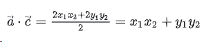

此方法未考虑向量长度，若其中一个向量长度很高，内积结果很大，但向量相似度并不高，可以除以向量模长来解决。
在Transformer中，除以根号k_dim(根号k_dim为q、k的列数)，用以解决transformer中数值过大的问题

## 三、自注意力机制
经过自注意力计算后形状不发生变化，例中依旧为4x5

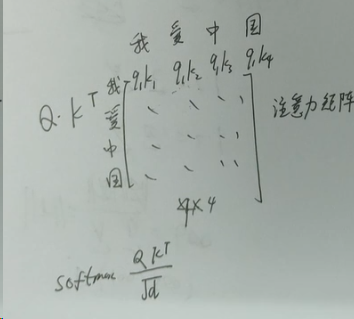

$$Attention(Q, K, V) = softmax\left(\frac{QK^T}{\sqrt{d_k}}\right)V$$
A=Q * Kt
Z=A * Z

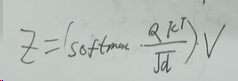

多头注意力

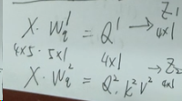

4x5为例，自注意力Z[4x5],多头注意力的一头Z1[4x1],Z由多头组成，又为[4x5]
注意力机制，一定要使用多头注意力，自注意时，每个字对自己的注意力是最高的

多头则可以把所有头的注意力权重都获取到

**Layer Normalization（横向规范化）**
综合考虑一层所有维度的输入，计算该层的平均输入值和输入方差，然后用同一个规范化操作来转换各个维度的输入。

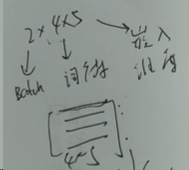

normalization不是对这20个维度取平均，而是先对第一个样本的1x5取平均值得到归一化，再依次对第二、三等进行处理

~~**Batch Normalization（纵向规范化）**
针对单个神经元进行，利用网络训练时一个 mini-batch 的数据来计算该神经元xi的均值和方差,因而称为 Batch Normalization~~

batch size(批次大小)

## 四、编码器(Encoder)

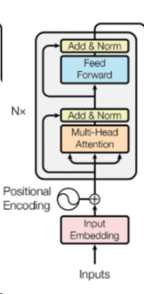

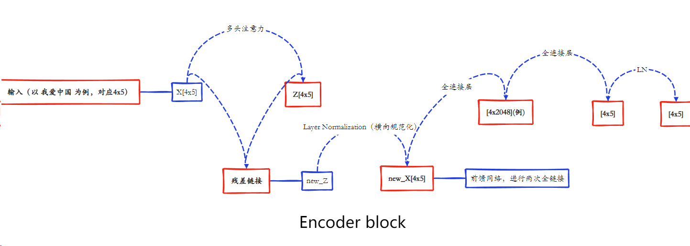

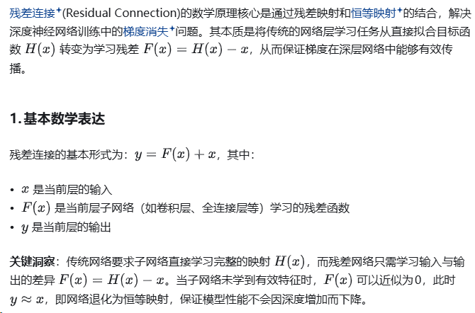

一个**Encoder block** 经过一次多头注意力和多次**Layer Normalization（横向规范化）**、全连接层

六个encoder block组成一个**Encoder**。输出[4x5]的矩阵，称为**Memory(编码信息矩阵)**

编码器将4×5的输入，编码成一个编码信息矩阵[4x5]。
整个模型的最终输出，要借助解码器decoder，把编码信息矩阵里的信息给解码出来

## 五、解码器(Decoder)

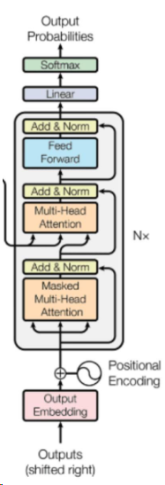

一个**Decoder block** 经过==两==次多头注意力和多次**Layer Normalization（横向规范化）**、全连接层

六个dncoder block组成一个**Dncoder**

==训练过程==中，解码器接受两个输入，一个Y，一个编码信息矩阵

我爱中国(X)  |  start I love China(Y)

X，进行词嵌入、位置编码；Y，同样进行词嵌入、位置编码

假设编码器输入设置四个词训练，我爱中国 不做改变，我爱你 则需加一个pad，即 我爱你 pad

pad 相当于第四个词，用来统一思路，多个pad之间没有注意力权重

假设解码器输出仍为四个词、嵌入维度Embedding为5。

Y输入到解码器中，先经过一个多头注意力层，输出4x5矩阵。还会经过残差层和LN层。

**经过第二个多头自注意力层，它的QKV来源和之前不一样。其中Q来源于解码器上一个多头自注意力层的输出乘以Wq；K来源于编码信息矩阵memory乘以Wk；V来源于编码信息矩阵memory乘以Wv**

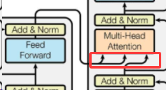

为什么Q来源于解码器的上一个多头自注意层，而K和V却来源于编码器的输出？

因为K和V是作为参考作用的，在翻译任务训练时，待翻译文本和翻译文本之间需要存在交叉注意力，比如生成 Iove 时，对 爱 的注意力要高一些

剩下的是前馈层和LN层

以上为一个dncoder block，六个组成一个**Dncoder**，输入输出都是4x5

最后还有两层，dence层，4x5经过后变成4x5000，这个5000是词汇表的数量

再经过softmax层，哪个值越大就认为是哪个单词，等于预测四个单词，实际上只提出最后一个词

在以上过程中，transformer的真实数据(ground truth)是**I love China end**

## 六、总结

transformer分为编码器和解码器，编码器的输入是4X5的  我爱中国 。解码器的输出输入是4X5的信息编码矩阵memory以及start I love China end