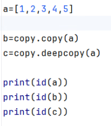
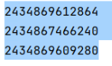
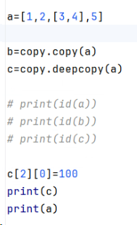
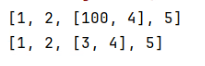
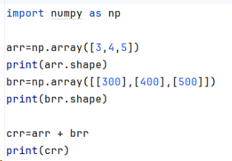
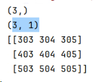
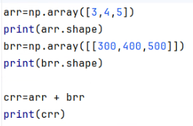
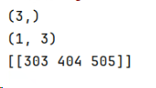
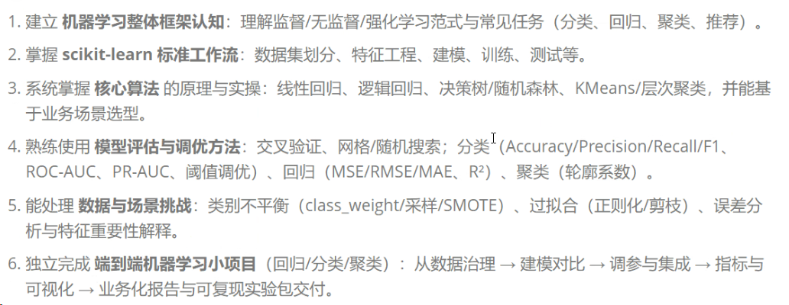

# 一、python
## 1、python中常用的数据类型：
可变对象：列表、字典、集合
不可变对象：元组、字符串
## 2、深浅拷贝

浅拷贝b更改影响a，均为[1,2,[100,4],5]
b更改嵌套外的内容，a不受影响

深拷贝c更改不影响a

## 3、装饰器
## 4、numpy广播机制（shape）
维度为一复制多次后形状一致aas

b的shape是(3,4)
ɑ想满足广播机制（3,1）（1,4） (1,1）

## 5、pandas
~~## 6、MYSQL
增删改查~~
## 6、Opencv -->numpy数字 -->(h,w,c(b,g,r))

## 7、机器学习

分类：有监督（分类、回归）、无监督（聚类、降维、关联规则学习）、强化学习（不断试错、累计奖励最大）
分类的评估指标：准确率、精确率、召回率、F1值（TP[正确正例]、TN[正确负例]、FP[错误正例]、FN[错误负例]）